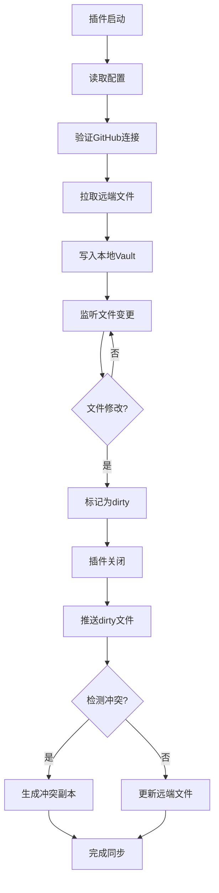

# Obsidian GitHub 同步插件产品需求文档

## 1. 产品概述

Obsidian GitHub 同步插件是一个为 Obsidian 用户设计的文件级同步工具，通过 GitHub REST API 实现 Vault 内容与 GitHub 仓库的自动同步。解决多设备间笔记同步问题，无需本地 Git 环境即可实现云端备份与协作。

目标用户：使用 Obsidian 进行知识管理的个人用户，需要在多设备间同步笔记内容，或希望将笔记备份到 GitHub 的开发者和技术用户。

## 2. 核心功能

### 2.1 用户角色

| 角色   | 注册方式                            | 核心权限                 |
| ---- | ------------------------------- | -------------------- |
| 普通用户 | GitHub Personal Access Token 认证 | 配置同步设置、执行文件同步、查看同步状态 |

### 2.2 功能模块

插件包含以下核心功能模块：

1. **设置配置模块**：GitHub 仓库信息配置、Token 管理、同步选项设置
2. **文件同步模块**：启动时自动拉取、文件变更监听、关闭时自动推送
3. **冲突处理模块**：冲突检测、冲突文件生成、用户提示
4. **状态监控模块**：状态栏显示、日志记录、错误提示

### 2.3 功能详情

| 功能模块 | 子功能       | 功能描述                                                   |
| ---- | --------- | ------------------------------------------------------ |
| 设置配置 | GitHub 认证 | 输入并保存 GitHub Personal Access Token，支持 fine-grained PAT |
| 设置配置 | 仓库配置      | 设置仓库 owner、repo 名称、分支、同步目录路径                           |
| 设置配置 | 本地映射      | 配置远端目录与本地 Vault 子目录的映射关系                               |
| 设置配置 | 同步选项      | 启用/禁用启动拉取、关闭推送、仅同步 Markdown                            |
| 设置配置 | 排除规则      | 设置文件排除模式，过滤不需要同步的文件                                    |
| 文件同步 | 启动拉取      | Obsidian 启动时自动从 GitHub 拉取文件到本地                         |
| 文件同步 | 变更监听      | 实时监听本地 Markdown 文件修改、创建事件                              |
| 文件同步 | 关闭推送      | Obsidian 关闭时将本地变更推送到 GitHub                            |
| 文件同步 | 文件过滤      | 根据文件类型和排除规则判断是否同步                                      |
| 冲突处理 | 冲突检测      | 对比本地和远端文件 SHA 值检测冲突                                    |
| 冲突处理 | 冲突解决      | 生成冲突副本文件，保留原文件不变                                       |
| 冲突处理 | 用户提示      | 通过 Notice 和状态栏提示冲突信息                                   |
| 状态监控 | 状态显示      | 在状态栏显示当前同步状态（idle/pulling/pushing/conflict/error）      |
| 状态监控 | 日志记录      | 记录同步过程、错误信息、文件变更                                       |
| 状态监控 | 错误处理      | API 请求失败时显示错误提示和详细日志                                   |

## 3. 核心流程

### 3.1 启动同步流程

1. 插件加载时读取配置和 Token
2. 初始化 GitHub API 客户端
3. 验证仓库访问权限
4. 获取远端文件列表
5. 过滤允许同步的文件
6. 逐个拉取文件内容
7. 写入本地 Vault（避免触发监听）
8. 更新同步元数据

### 3.2 文件变更流程

1. 用户编辑 Markdown 文件
2. 文件监听器检测到变更
3. 判断是否属于同步范围
4. 标记文件为 dirty
5. 更新状态栏显示

### 3.3 关闭推送流程

1. 遍历所有 dirty 文件
2. 读取本地文件内容
3. 获取远端文件当前 SHA
4. 对比上次同步 SHA
5. 无冲突时更新远端文件
6. 有冲突时生成冲突副本
7. 更新同步元数据
8. 清理 dirty 标记

## 4. 用户界面设计

### 4.1 设计规范

* **主色调**：Obsidian 原生深色主题适配，使用 #7C3AED 作为强调色

* **按钮样式**：圆角矩形，符合 Obsidian 原生组件风格

* **字体**：继承 Obsidian 默认字体，大小 14px

* **布局**：设置面板采用分组卡片式布局

* **图标**：使用 Obsidian 内置图标或简洁的线形图标

### 4.2 界面元素

| 界面位置 | 组件名称      | 设计说明                         |
| ---- | --------- | ---------------------------- |
| 设置面板 | GitHub认证区 | Token输入框、测试连接按钮、权限验证状态       |
| 设置面板 | 仓库配置区     | Owner/Repo输入框、分支选择、目录路径设置    |
| 设置面板 | 同步选项区     | 复选框控制自动拉取/推送、文件类型过滤          |
| 设置面板 | 排除规则区     | 文本域输入排除模式、默认规则展示             |
| 状态栏  | 同步状态      | 显示"GitSync: \[状态]"，状态变化时颜色变化 |
| 通知中心 | 操作提示      | 同步成功/失败/冲突时使用 Notice 组件提示    |

### 4.3 响应式设计

* 桌面端优先，适配 Obsidian 的默认界面尺寸

* 设置面板宽度自适应 Obsidian 设置窗口

* 状态栏信息在窄窗口下显示简化状态

## 5. 非功能性需求

### 5.1 性能要求

* 启动拉取应在 10 秒内完成（100 个文件以内）

* 文件监听响应时间 < 100ms

* 内存占用不超过 50MB

### 5.2 可靠性要求

* 网络异常时自动重试，最多 3 次

* 同步过程中插件崩溃可恢复状态

* Token 失效时给出明确提示

### 5.3 安全性要求

* Token 必须加密存储，不能明文保存

* 支持随时撤销和重新配置 Token

* 不记录文件内容到日志

### 5.4 兼容性要求

* 支持 Obsidian v1.0+

* 支持 Windows、macOS、Linux

* 支持移动端基础功能（后续版本）

