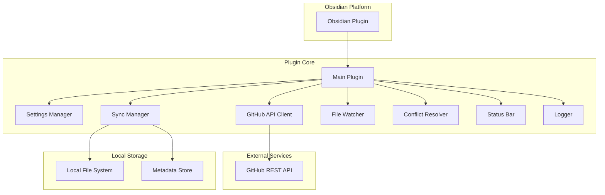
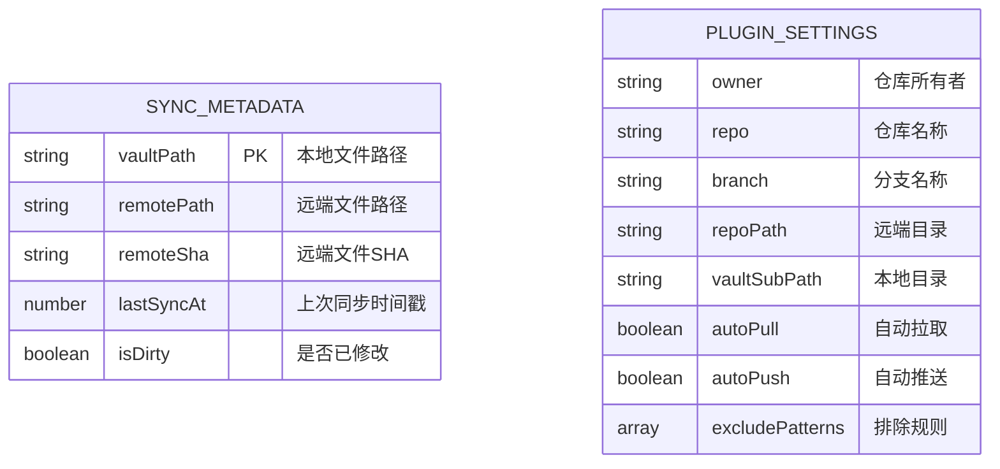

# Obsidian GitHub 同步插件技术架构文档

## 1. 架构设计



## 2. 技术栈描述

- **开发语言**: TypeScript 5.0+
- **构建工具**: esbuild + npm
- **目标平台**: Obsidian Plugin API
- **依赖库**: 
  - obsidian (Obsidian API)
  - @octokit/rest (GitHub API 客户端)
  - base64 (编码处理)
- **初始化工具**: Obsidian Sample Plugin 模板

## 3. 核心模块定义

### 3.1 主要文件结构
| 文件路径 | 模块职责 |
|----------|----------|
| src/main.ts | 插件入口，生命周期管理 |
| src/settings.ts | 配置管理，设置面板 |
| src/types.ts | TypeScript 类型定义 |
| src/github-api.ts | GitHub REST API 封装 |
| src/sync-manager.ts | 同步逻辑核心 |
| src/file-watcher.ts | 文件变更监听 |
| src/conflict-resolver.ts | 冲突处理逻辑 |
| src/metadata-store.ts | 同步元数据存储 |
| src/path-filter.ts | 文件过滤规则 |
| src/logger.ts | 日志管理 |
| src/status-bar.ts | 状态栏显示 |

### 3.2 核心类定义

#### PluginSettings 接口
```typescript
interface PluginSettings {
  owner: string;                    // GitHub 仓库所有者
  repo: string;                     // 仓库名称
  branch: string;                   // 分支名称
  repoPath: string;                 // 远端同步目录
  vaultSubPath: string;             // 本地 Vault 子目录
  autoPullOnStartup: boolean;       // 启动时自动拉取
  autoPushOnShutdown: boolean;      // 关闭时自动推送
  syncMarkdownOnly: boolean;        // 仅同步 Markdown
  excludePatterns: string[];        // 排除规则
  requestTimeoutMs: number;         // 请求超时时间
}
```

#### SyncMetadata 接口
```typescript
interface SyncMetadata {
  remoteShaByPath: Record<string, string>;  // 文件路径到远端 SHA 的映射
  lastSyncAt?: number;                      // 上次同步时间戳
}
```

#### RemoteFileMeta 接口
```typescript
interface RemoteFileMeta {
  path: string;                     // 文件路径
  sha: string;                      // 文件 SHA
  size: number;                     // 文件大小
  type: "file" | "dir";             // 文件类型
}
```

## 4. API 接口定义

### 4.1 GitHub API 封装

#### 验证仓库访问
```
GET /repos/{owner}/{repo}/contents/{path}
Headers: {
  Authorization: token {PAT},
  Accept: application/vnd.github.v3+json
}
```

#### 获取文件内容
```
GET /repos/{owner}/{repo}/contents/{path}?ref={branch}
Response: {
  type: "file",
  encoding: "base64",
  content: "base64_content",
  sha: "file_sha"
}
```

#### 创建或更新文件
```
PUT /repos/{owner}/{repo}/contents/{path}
Body: {
  message: "commit_message",
  content: "base64_content",
  sha: "current_sha",  // 更新时必需
  branch: "branch_name"
}
```

### 4.2 内部方法定义

#### GitHubApiClient 类
```typescript
class GitHubApiClient {
  constructor(config: GitHubConfig)
  
  // 验证仓库访问权限
  validateAccess(): Promise<void>
  
  // 获取目录文件列表
  listFiles(path: string): Promise<RemoteFileMeta[]>
  
  // 获取文件内容
  getFile(path: string): Promise<RemoteFileContent>
  
  // 创建或更新文件
  createOrUpdateFile(input: UpsertFileInput): Promise<void>
  
  // 获取文件 SHA
  getFileSha(path: string): Promise<string | null>
}
```

#### SyncManager 类
```typescript
class SyncManager {
  private dirtyFiles: Set<string>
  private syncStatus: SyncStatus
  
  // 初始化同步管理器
  initialize(): Promise<void>
  
  // 启动时拉取
  pullOnStartup(): Promise<void>
  
  // 关闭时推送
  pushOnShutdown(): Promise<void>
  
  // 标记文件为脏
  markDirty(path: string): void
  
  // 判断是否应该同步
  shouldSync(path: string): boolean
}
```

## 5. 数据模型设计

### 5.1 同步元数据存储


### 5.2 文件存储结构
```
.obsidian/plugins/obsidian-github-sync/
├── data.json              # 插件配置（不含token）
├── metadata.json          # 同步元数据
└── manifest.json          # 插件清单

Vault 中的冲突文件：
├── note.md                # 原文件（保留本地内容）
├── note.conflict.local.md # 本地版本副本
└── note.conflict.remote.md # 远端版本副本
```

## 6. 同步算法设计

### 6.1 启动拉取算法
```typescript
async function pullOnStartup(): Promise<void> {
  // 1. 获取远端文件列表
  const remoteFiles = await githubApi.listFiles(repoPath)
  
  // 2. 过滤允许同步的文件
  const syncFiles = remoteFiles.filter(file => shouldSync(file.path))
  
  // 3. 逐个处理文件
  for (const file of syncFiles) {
    // 获取文件内容
    const content = await githubApi.getFile(file.path)
    
    // 计算本地路径
    const localPath = mapToLocalPath(file.path)
    
    // 检查本地文件状态
    const localExists = await fileExists(localPath)
    const localModified = await isFileModified(localPath, content.sha)
    
    if (!localExists) {
      // 本地不存在，直接创建
      await writeFile(localPath, content.contentBase64, true)
      metadataStore.updateSha(file.path, content.sha)
    } else if (!localModified) {
      // 本地未修改，远端有更新，覆盖
      await writeFile(localPath, content.contentBase64, true)
      metadataStore.updateSha(file.path, content.sha)
    } else {
      // 本地已修改，进入冲突处理
      await conflictResolver.resolvePullConflict({
        path: file.path,
        localContent: await readFile(localPath),
        remoteContent: content.contentBase64
      })
    }
  }
  
  metadataStore.updateLastSyncTime()
}
```

### 6.2 冲突检测算法
```typescript
async function detectConflict(filePath: string): Promise<boolean> {
  // 获取上次同步的 SHA
  const lastSyncSha = metadataStore.getSha(filePath)
  
  // 获取当前远端 SHA
  const currentRemoteSha = await githubApi.getFileSha(filePath)
  
  // 如果远端 SHA 与上次不同，说明远端已被修改
  return lastSyncSha !== currentRemoteSha
}
```

## 7. 错误处理设计

### 7.1 错误分类
| 错误类型 | 处理方式 | 用户提示 |
|----------|----------|----------|
| 网络错误 | 重试3次，指数退避 | 显示"网络连接失败" |
| 认证错误 | 停止同步，记录日志 | 显示"GitHub认证失败，请检查Token" |
| 仓库不存在 | 停止同步 | 显示"仓库不存在或无权访问" |
| 文件冲突 | 生成冲突副本 | 显示"检测到文件冲突，已生成副本" |
| API限流 | 等待后重试 | 显示"GitHub API限流，稍后重试" |

### 7.2 日志级别
```typescript
enum LogLevel {
  DEBUG = 0,    // 调试信息
  INFO = 1,     // 一般信息
  WARN = 2,     // 警告信息
  ERROR = 3     // 错误信息
}
```

## 8. 性能优化策略

### 8.1 文件监听优化
- 使用防抖机制，避免频繁触发同步
- 批量处理文件变更事件
- 排除系统临时文件和缓存文件

### 8.2 网络请求优化
- 并发请求限制（最大5个）
- 请求结果缓存（5分钟）
- 增量同步，只处理变更的文件

### 8.3 内存使用优化
- 及时清理临时数据
- 使用流式处理大文件
- 定期清理过期日志

## 9. 安全考虑

### 9.1 Token 安全
- 使用 Obsidian Secret Storage API 存储 Token
- 不在日志中记录 Token
- 支持 Token 更新和撤销

### 9.2 文件安全
- 同步前验证文件类型
- 限制同步文件大小（最大10MB）
- 避免同步可执行文件

### 9.3 网络安全
- 所有 API 请求使用 HTTPS
- 请求超时控制（默认15秒）
- 错误信息脱敏处理